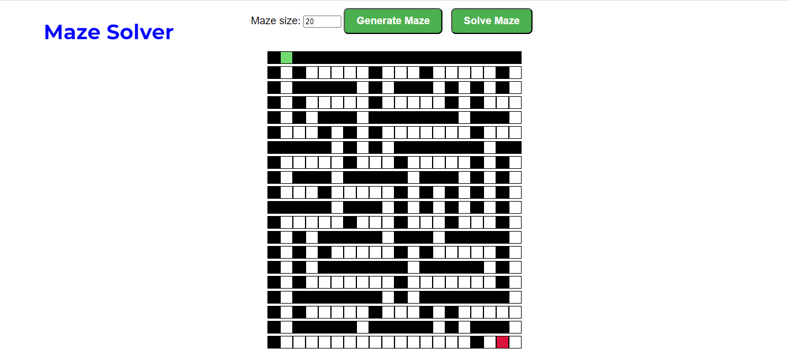
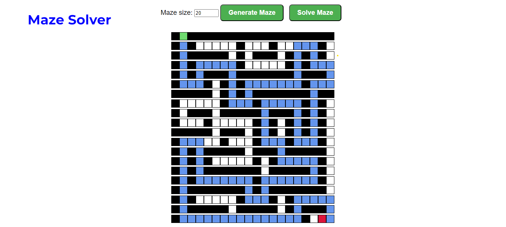

# Maze Solver


**Conteúdo da Disciplina**: Grafos1<br>

## Alunos
|Matrícula | Aluno |
| -- | -- |
| 19/0118555  |  Wengel Rodrigues Farias |


## Sobre 
O projeto é um Maze Solver, um programa que representa um labirinto como um grafo, onde cada célula do labirinto é um nó do grafo e as paredes entre as células são as arestas. O objetivo é implementar o algoritmo de busca em largura (BFS) para encontrar o caminho entre o nó inicial e o nó final do labirinto

## Screenshots


 

## Instalação 
**Linguagem**: Python<br>
**Framework**: Flask<br>

- ### Windows
Baixe o pacote Python3 do [site official](https://www.python.org/downloads/), e no momento da instação, marque a opção "Add Python to PATH" para no próximo passo instalar as dependências via terminal e rodar o projeto.

- ### Linux
Execute no terminal do linux a atualização dos pacotes e instalação do python3

```bash
sudo apt-get update
sudo apt-get install python3
```
# Execução
Abra um terminal na pasta **Script** do projeto e execute o comando:
```
.\start.bat
```
Abra outro terminal na pasta **Script** e execute  o comando:
```
.\venv.bat
```

## Uso 
Explique como usar seu projeto caso haja algum passo a passo após o comando de execução.

## Outros 
Quaisquer outras informações sobre seu projeto podem ser descritas abaixo.


